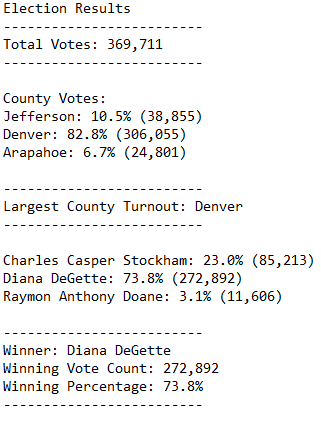

# Election Audit Analysis

## Project Overview

A Colorado Board of Elections employee hired me for the following tasks to complete the election audit of a recent local congressional election.

1. Calculate the total number of votes cast.
2. Calculate the voter turnout for each county.
3. Calculate the percentage of votes from each county out of the total count.
4. Determine the county with the highest turnout.
5. Get a complete list of candidate who received votes.
6. Calculate the total number of votes each candidate received.
7. Calculate the percentage of votes each candidate won.
8. Determine the winner of the election based on popular vote.

## Resources

- Data Source: [election_results.csv](Resources/election_results.csv)
- Software: Python 3.7.6, Visual Studio Code, 1.62.2

## Election Audit Results

The election audit results may be viewed and downloaded here: [election_analysis.txt](Analysis/election_analysis.txt)

### County Results

- There were 369,711 votes cast in the election.
- The county results were:
    - Jefferson County cast 10.5% of the vote and 38,855 number of votes.
    - Denver County cast 82.8% of the vote and 306,055 number of votes.
    - Arapahoe County cast 6.7% of the vote and 24,801 number of votes.
- Denver County had the largest turnout of the three counties in the precinct. 

### Candidate Results

- The candidates were:
    - Charles Casper Stockham
    - Diana DeGette
    - Raymon Anthony Doane
- The candidate results were:
    - Charles Casper Stockham received 23.0% of the vote and 85,213 number of votes.
    - Diana DeGette received 73.8% of the vote and 272,892 number of votes.
    - Raymon Anthony Doane received 3.1% of the vote and 11,606 number of votes.
- The winner of the election was:
    - Candidate Diana DeGette, who received 73.8% of the vote and 272,892 number of votes.

## Election Audit Summary

With only a few small modifications, the Python script developed for this congressional election can be used for all elections managed by the election commission. 

To start, the script is designed to be used with multiple operating systems (Microsoft Windows, macOS, etc.) by using the Python os module and creating paths to the election results data and a new election analysis text file created by the script:
```
# Add our dependencies.
import csv
import os

# Add a variable to load a file from a path.
file_to_load = os.path.join("Resources", "election_results.csv")
# Add a variable to save the file to a path.
file_to_save = os.path.join("Analysis", "election_analysis.txt")
```
Next, the script reads the election results data from the original file, removing the need for the user to manually transfer the data:
```
with open(file_to_load) as election_data:
    file_reader = csv.reader(election_data)
```
Then the script uses for loops to read through each row of the data and perform the election analysis:
```
    # For each row in the CSV file.
    for row in file_reader:

        # Add to the total vote count
        total_votes = total_votes + 1

        # Get the candidate name from each row.
        candidate_name = row[2]

        # 3: Extract the county name from each row.
        county_name = row[1]
```
Finally, the script writes the election audit analysis to the text file in a clear and concise format that can be easily viewed and shared by the election commission.

#### Python script example:

```
# Save the results to our text file.
with open(file_to_save, "w") as txt_file:

    # Print the final vote count (to terminal)
    election_results = (
        f"\nElection Results\n"
        f"-------------------------\n"
        f"Total Votes: {total_votes:,}\n"
        f"-------------------------\n\n"
        f"County Votes:\n")
    print(election_results, end="")

    txt_file.write(election_results)
```
#### Text file with full election audit analysis:


